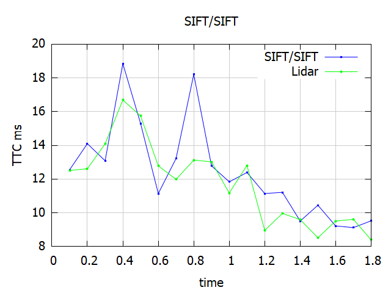
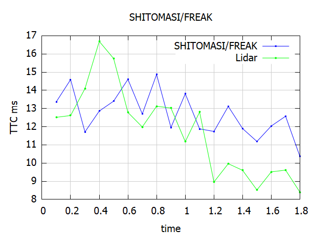
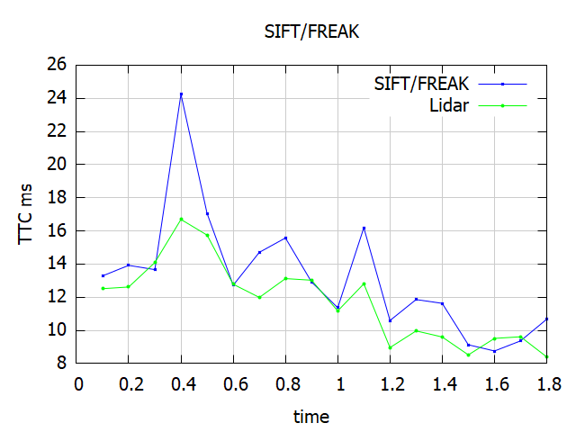

# LIDAR-and-Camera-Fusion-To-estimate-TTC-of-3D-Objects

Welcome to the final project of the camera course. By completing all the lessons, you now have a solid understanding of keypoint detectors, descriptors, and methods to match them between successive images. Also, you know how to detect objects in an image using the YOLO deep-learning framework. And finally, you know how to associate regions in a camera image with Lidar points in 3D space. Let's take a look at our program schematic to see what we already have accomplished and what's still missing.

In this final project, you will implement the missing parts in the schematic. To do this, you will complete four major tasks: 
1. First, you will develop a way to match 3D objects over time by using keypoint correspondences. 
2. Second, you will compute the TTC based on Lidar measurements. 
3. You will then proceed to do the same using the camera, which requires to first associate keypoint matches to regions of interest and then to compute the TTC based on those matches. 
4. And lastly, you will conduct various tests with the framework. Your goal is to identify the most suitable detector/descriptor combination for TTC estimation and also to search for problems that can lead to faulty measurements by the camera or Lidar sensor. In the last course of this Nanodegree, you will learn about the Kalman filter, which is a great way to combine the two independent TTC measurements into an improved version which is much more reliable than a single sensor alone can be. But before we think about such things, let us focus on your final project in the camera course.

## Final Project Report
### The Results of the project

### FP.1 Match 3D Objects
In camFusion_Studen.cpp , function matchBoundingBoxes(), already implemented to return Matches with the highest number of keypoint correspondences.
A 2D table is made , to record all occurences , then it's filtered to get the matched withe high occurances.

### FP.2 Compute Lidar-based TTC
In camFusion_Studen.cpp , function computeTTCLidar(),implemented to avoid clutter points on vehicle tailgate by considering points
on ego lane and median of points.

### FP.3 Associate Keypoint Correspondences with Bounding Boxes
In camFusion_Studen.cpp , function clusterKptMatchesWithROI(),implemented to associate keypoints with bounding boexes using the eculdian distance.

### FP.4 Compute Camera-based TTC
In camFusion_Studen.cpp , function computeTTCCamera(), same implementation in exercise.Which uses median distance to ration to accurtely 
calculate TTC.But there are some miscalculation , i overcome this issue by outouting the last output in case finding any issue could lead 
to this miscalcualtion.

### FP.5 Performance Evaluation 1
I did not find any issue with TTC lidar estimation , it themes very reasonable and stable..I guess using the median technique avioded a lot of issues that appears in using the closet point.

### FP.6 Performance Evaluation 2
Camera TTC estimation is not stable , unlike the lidar which accurate and stable.
This alredy expected since as it mentioned in the lesson , lidar is better than camera for position detection.

TOP3 detector / descriptor:
- SIFT/SIFT

- SHITOMASI/FREAK

- SIFT/FREAK

# NOTES:
- AKAZE descriptors will only work with AKAZE keypoints.
- SIFT detector with ORB descriptor ran out of memory.
- The spreadsheet in pdf format can be found [here.](https://github.com/m-loay/Sensor-Fusion-Self-Driving-Car/blob/master/SFND_3D_Object_Tracking/Results.pdf)

## Dependencies for Running Locally
* cmake >= 2.8
  * All OSes: [click here for installation instructions](https://cmake.org/install/)
* make >= 4.1 (Linux, Mac), 3.81 (Windows)
  * Linux: make is installed by default on most Linux distros
  * Mac: [install Xcode command line tools to get make](https://developer.apple.com/xcode/features/)
  * Windows: [Click here for installation instructions](http://gnuwin32.sourceforge.net/packages/make.htm)
* Git LFS
  * Weight files are handled using [LFS](https://git-lfs.github.com/)
* OpenCV >= 4.1
  * This must be compiled from source using the `-D OPENCV_ENABLE_NONFREE=ON` cmake flag for testing the SIFT and SURF detectors.
  * The OpenCV 4.1.0 source code can be found [here](https://github.com/opencv/opencv/tree/4.1.0)
* gcc/g++ >= 5.4
  * Linux: gcc / g++ is installed by default on most Linux distros
  * Mac: same deal as make - [install Xcode command line tools](https://developer.apple.com/xcode/features/)
  * Windows: recommend using [MinGW](http://www.mingw.org/)

## Basic Build Instructions

1. Clone this repo.
2. Make a build directory in the top level project directory: `mkdir build && cd build`
3. Compile: `cmake .. && make`
4. Run it: `./3D_object_tracking`.
